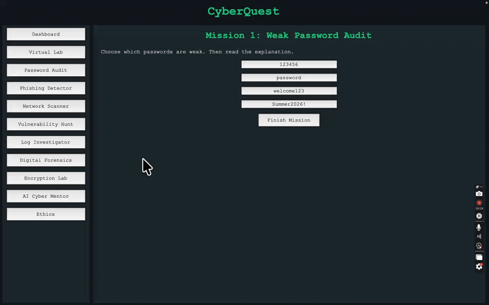

# CyberQuest - Ethical Hacking Simulator

CyberQuest is a beginner-friendly cybersecurity training app made with Python, Tkinter, and Pydantic.

Students complete safe simulated missions instead of attacking real computers. The goal is to learn cybersecurity concepts, ethics, and defensive thinking.

## Features
- Virtual hacking lab with simulated systems
- Weak password audit
- Phishing email detector
- Safe network scanner simulation
- Vulnerability hunt
- Log investigator
- Digital forensics challenge
- Encryption lab with Caesar cipher, Vigenere cipher, and SHA-256 hashing
- Simple AI Cyber Mentor
- XP, badges, levels, and a dashboard


## Future Improvements
- Add student login so each student can save their own progress.
- Save XP, badges, and completed missions to a file.
- Add more missions about secure coding, malware awareness, and incident response.
- Add more realistic fake logs for students to investigate.
- Add a quiz mode after each mission.
- Add sound effects or animations when students earn badges.
- Add teacher mode so an instructor can view class progress.
- Add difficulty levels for beginner, intermediate, and advanced students.
- Add more cryptography examples, such as RSA demonstrations.
- Add printable certificates when students complete all missions.
- add a real openAI Cyber Mentor, using OpenAI API. 


## 📸 Demo



<p><em> Live Demo</em></p>

## How To Run

Install the requirement:

```bash
pip install -r requirements.txt
```

Start the app:

```bash
python3 main.py
```

## Safety Note

This app does not scan real networks, attack real systems, or collect real credentials. Everything is simulated for learning.

## Beginner Notes

The code is written in a simple style on purpose. Most functions have clear names, and the app avoids complicated patterns so students can read and edit it.
